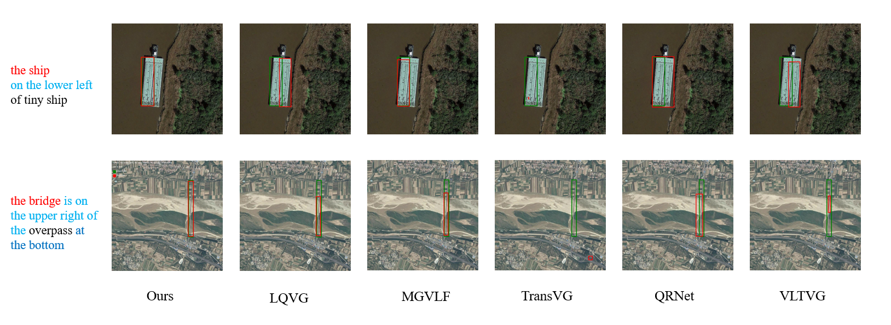

# VCSL: From Cross-Modal Alignment to Visual-Centric Similarity Learning for Remote Sensing Visual Grounding

Welcome to the official implementation of VCSL. This repository contains the complete codebase and detailed instructions for training and deploying VCSL.

------

## 📊 Visualization



Visual grounding on long sentences is a known difficulty for VLMs. For an intuitive evaluation under complex scenarios, we present a visual comparison of grounding results between VCSL and four classic models.

------

## ⚙️ Environment & Installation

### 1. Overview

This section provides step-by-step instructions to set up the environment and install all dependencies required to run the VCSL model.

### 2. Prerequisites

- **Operating System**: Ubuntu 18.04/20.04
- **CUDA**: 11.1 or higher
- **Python**: 3.7.12

### 3. Detailed Installation Steps

#### Using Conda (Recommended)

```bash
# Create and activate conda environment
conda create -n VCSL python=3.7
conda activate vcsl

# Install PyTorch with CUDA support
conda install pytorch==1.8.1 torchvision==0.9.1 cudatoolkit=11.1 -c pytorch

# Install additional dependencies
pip install -r requirements.txt
```

### 4. Dependency Details

Our `requirements.txt` includes:

- **Core**: torch, torchvision, numpy, pandas
- **Vision**: opencv-python, Pillow, scikit-image
- **Utilities**: tqdm, matplotlib
- **Data**: pycocotools, scipy, h5py

### 5. Environment Verification

After installation, verify your setup:

```bash
# Check PyTorch installation
python -c "import torch; print(f'PyTorch: {torch.__version__}')"
python -c "import torch; print(f'CUDA available: {torch.cuda.is_available()}')"
```

Expected output:

```
✓ PyTorch 1.8.1 installed
✓ CUDA available: True
```


### 6. Troubleshooting

#### Common Issues

1. **CUDA Version Mismatch**

   ```bash
   # Check CUDA version
   nvcc --version
   # Reinstall PyTorch with matching CUDA version
   pip install torch==1.8.1+cu111 -f https://download.pytorch.org/whl/torch_stable.html
   ```

   

2. **Permission Denied Errors**

   ```bash
   # Use pip with --user flag
   pip install --user -r requirements.txt
   ```

   

------

## 📁 Data Preparation

We primarily use two datasets: **DIOR-RSVG** and **OPT-RSVG**.

- **DIOR-RSVG**:
  Can be downloaded from https://huggingface.co/datasets/LittleCollections/DIOR-RSVG/tree/main.
  This dataset requires preprocessing to split multiple targets from a single XML file into separate XML files to accommodate the data loading pipeline. We provide `data_prepare.py` for dataset preprocessing. Run this script to transform the raw data into the proper format for model training and evaluation.
- **OPT-RSVG**:
  Can be downloaded from https://drive.google.com/drive/folders/1e_wOtkruWAB2JXR7aqaMZMrM75IkjqCA.

The file trees of the two datasets are shown as follows:

text

```
data/
├── DIOR-RSVG/                    
│   ├── train.txt                  
│   ├── val.txt                    
│   ├── test.txt                   
│   ├── Annotations/              
│   │   ├── 000001.xml
│   │   ├── 000002.xml
│   │   ├── 000003.xml
│   │   └── ...
│   └── JPEGImages/               
│       ├── 000001.jpg
│       ├── 000002.jpg
│       ├── 000003.jpg
│       └── ...
└── OPT-RSVG/                      
    ├── train.txt                 
    ├── val.txt                    
    ├── test.txt                  
    ├── Annotations/               
    │   ├── 000001.xml
    │   ├── 000002.xml
    │   ├── 000003.xml
    │   └── ...
    └── JPEGImages/               
        ├── 000001.jpg
        ├── 000002.jpg
        ├── 000003.jpg
        └── ...
```


------

## 🚀 Training and Inference

You can train the VCSL model by running `main.py`. We allow specifying the dataset for training/inference, learning rate drop epochs, and special parameters for the SFD module via command-line arguments.

### Example Training Command:

```bash
CUDA_VISIBLE_DEVICES='0,1,2,3' python3 -m torch.distributed.launch --nproc_per_node=4 \
--master_port 29516 --use_env main.py --dataset_file rsvg \
--use_sfd --sfd_atoms 512 --sfd_alpha 0.8  --batch_size 2 --num_frames 1 --lr_drop 60 70  --epochs 70   \
--num_queries 10 --output_dir Finaloutput \
--rsvg_path /path/to/your/dataset
```

Replace `/path/to/your/dataset` with the path to your dataset.

Similarly, you can perform inference by running `inference_rsvg.py`. The specific details for these two parts (training and inference) can be found in the `train.sh` and `test.sh` scripts.

Manual inference command example:

```bash
CUDA_VISIBLE_DEVICES='0' python inference_rsvg.py \
--dataset_file rsvg --use_sfd --sfd_atoms 512 --sfd_alpha 0.8 \
--num_queries 10 --resume /path/to/checkpoint.pth \
--rsvg_path /path/to/your/dataset/
```

**Note**: Replace `/path/to/checkpoint.pth` with the path to your trained model checkpoint.
